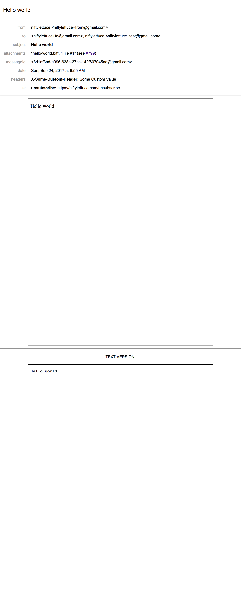

# preview-email

[](https://travis-ci.org/niftylettuce/preview-email)
[](https://codecov.io/gh/niftylettuce/preview-email)
[](https://github.com/sindresorhus/xo)
[](https://github.com/prettier/prettier)
[](https://lass.js.org)
[]()

> Automatically opens your browser to preview [Node.js][node] email messages sent with [Nodemailer][]. Made for [Lad][]!


## Table of Contents

* [Screenshot](#screenshot)
* [Install](#install)
* [Usage](#usage)
* [Custom Preview Template and Stylesheets](#custom-preview-template-and-stylesheets)
* [Debugging](#debugging)
* [Options](#options)
* [Contributors](#contributors)
* [License](#license)


## Screenshot




## Install

[npm][]:

```sh
npm install preview-email
```

[yarn][]:

```sh
yarn add preview-email
```


## Usage

> **NOTE**: You should probably just use [email-templates][] directly instead of using this package.

The function `previewEmail` returns a `Promise` which resolves with a URL. We automatically open the browser to this URL unless you specify `options.open` as `false` (see [Options](#options) for more info).

```js
const previewEmail = require('preview-email');
const nodemailer = require('nodemailer');

const transport = nodemailer.createTransport({
  jsonTransport: true
});

// <https://nodemailer.com/message/>
const message = {
  from: 'niftylettuce+from@gmail.com',
  to: 'niftylettuce+to@gmail.com',
  subject: 'Hello world',
  html: '<p>Hello world</p>',
  text: 'Hello world',
  attachments: [ { filename: 'hello-world.txt', content: 'Hello world' } ]
};

// note that `attachments` will not be parsed unless you use
// `previewEmail` with the results of `transport.sendMail`
// e.g. `previewEmail(JSON.parse(res.message));` where `res`
// is `const res = await transport.sendMail(message);`
previewEmail(message).then(console.log).catch(console.error);

transport.sendMail(message).then(console.log).catch(console.error);
```


## Custom Preview Template and Stylesheets

Using the `options.template` object, you can define your own template for rendering (e.g. get inspiration from [template.pug](template.pug) and write your own!):

```js
const path = require('path');

// ...

previewEmail(message, { template: path.join(__dirname, 'my-custom-preview-template.pug') })
  .then(console.log)
  .catch(console.error);
```


## Debugging

Thanks to the [debug][] package, you can easily debug output from `preview-email`:

```sh
DEBUG=preview-email node app.js
```


## Options

* `message` (Object) - a [Nodemailer message configuration object](https://nodemailer.com/message/)
* `options` (Object) - an object with the following two properties:
  * `id` (String) - a unique ID for the file name created for the preview in `dir` (defaults to `uuid.v4()` from [uuid][])
  * `dir` (String) - a path to a directory for saving the generated email previews (defaults to `os.tmpdir()`, see [os docs](https://nodejs.org/api/os.html#os_os_tmpdir) for more insight)
  * `open` (Object or Boolean) - an options object that is passed to [open][] (defaults to `{ wait: false }`) - if set to `false` then it will not open the email automatically in the browser using [open][], and if set to `true` then it will default to `{ wait: false }`
  * `template` (String) - a file path to a `pug` template file (defaults to preview-email's [template.pug](template.pug) by default) - **this is where you can pass a custom template for rendering email previews, e.g. your own stylesheet**
  * `urlTransform` (Function (path) => url) - a function to build preview url from file path (defaults to `(path) => 'file://[file path]'`) - *this is where you can customize the opened path to handle WSL to Windows transformation or build a http url if `dir` is served.*


## Contributors

| Name           | Website                    |
| -------------- | -------------------------- |
| **Nick Baugh** | <http://niftylettuce.com/> |


## License

[MIT](LICENSE) © [Nick Baugh](http://niftylettuce.com/)


##

[npm]: https://www.npmjs.com/

[yarn]: https://yarnpkg.com/

[email-templates]: https://github.com/niftylettuce/email-templates

[node]: https://nodejs.org/

[nodemailer]: https://nodemailer.com

[uuid]: https://github.com/kelektiv/node-uuid

[lad]: https://lad.js.org

[open]: https://github.com/sindresorhus/open

[debug]: https://github.com/visionmedia/debug
